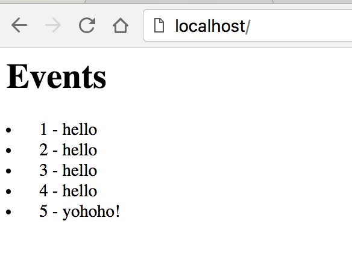

# Events

Toy application displaying the power of docker-compose and modular web
application design.

Service | Description
--------|------------
Web     | Nginx proxy for Front and Api
Api     | HTTP API that allows listing existing events
Front   | React/Webpack/Node app for HTML interface
Worker  | Listens on "events" Rabbit exchange and saves incomming events into a database

## Setup

Create events database table:

``` bash
docker-compose up db &
docker-compose exec db su -c 'createdb events' postgres
```

This is the most dubious part. Maybe it could be done programaticaly?

## How to use

Start the app:

``` sh
docker-compose up
```

Publish an event:

``` sh
docker-compose exec worker publish '{ "event": "yohohoho!" }'
```

List API actions:

``` sh
$ curl localhost:3000

{ "supported_actions": ["GET /events"] }
```

List events:

``` sh
$ curl localhost:3000

[{"id": 1, "description": {"event":"hello"}]
```

HTML:

Visit `locahost` in your browser to observe stored events.


